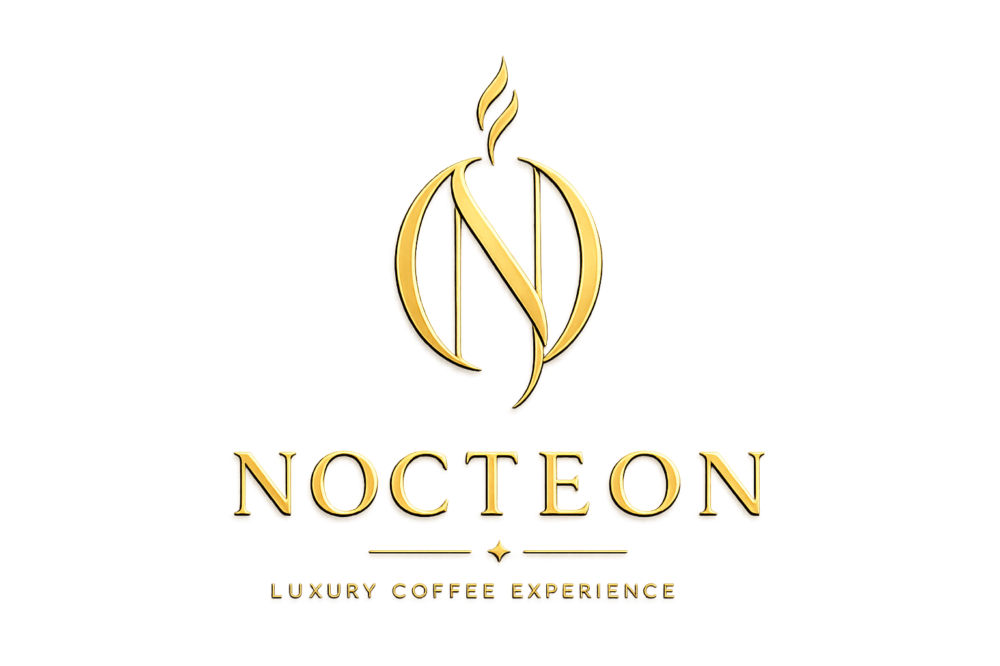
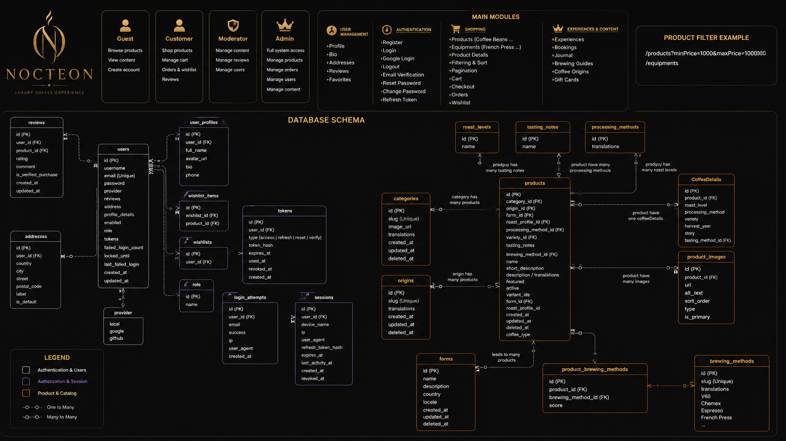

<div align="center">



# NOCTEON COFFEE

### Luxury Coffee Experience Platform

Enterprise-grade backend powering a premium specialty coffee experience.


</div>

---

# ☕ About

Nocteon Coffee is not a traditional e-commerce application.

It is a **Luxury Coffee Experience Platform** built to provide:

- Specialty Coffee Commerce
- Educational Coffee Content
- Brewing Guides
- Premium Customer Experiences
- Memberships & Loyalty
- Gift Cards
- Future Booking Experiences

The backend is built using **Spring Boot** following modern software engineering principles and production-ready practices.

---

# 🏛 System Architecture

<div align="center">

</div>

---

# ✨ Features

## 🔐 Authentication

- JWT Authentication
- Refresh Token Rotation
- RSA Signing Keys
- Email Verification
- Password Reset
- Change Password
- Google OAuth2 Login
- Logout & Session Management
- Account Lock Protection
- Rate Limiting

---

## 👤 User Management

- User Profiles
- Multiple Addresses
- Favorites & Wishlist
- Reviews
- Session Tracking

---

## 🛒 Shopping

- Coffee Products
- Equipment Products
- Product Variants
- Product Images
- Filtering & Pagination
- Shopping Cart
- Checkout
- Orders Management

---

## 🌍 Internationalization

Translation support for:

- Products
- Categories
- Origins
- Farms
- Roast Profiles
- Processing Methods
- Coffee Varieties
- Tasting Notes
- Brewing Methods
- Journal Categories
- Journal Posts

---

## 📝 Content System

- Coffee Journal
- Brewing Guides
- Coffee Origins
- Rich Articles

---

## 🚀 Future Features

- Experiences
- Membership Program
- Gift Cards
- Loyalty System
- Booking System

---

# 🏗 Architecture & Design Principles

- Clean Architecture
- SOLID Principles
- Domain Driven Design (DDD)
- RESTful API Design
- DTO Pattern
- Repository Pattern
- Service Layer Pattern
- Global Exception Handling
- Validation Layer
- Multi-language Architecture

---

# 🛠 Tech Stack

| Technology | Version |
|------------|----------|
| Java | 21 |
| Spring Boot | 3.x |
| Spring Security | Latest |
| Spring Data JPA | Latest |
| PostgreSQL | 16 |
| Redis | 7 |
| Docker | Latest |
| Maven | Latest |
| JWT | Latest |
| Cloudinary | Latest |
| MapStruct | Latest |
| Lombok | Latest |

---

# 📦 Modules

```text
Authentication
Users
Profiles
Addresses
Products
Categories
Origins
Farms
Roast Profiles
Processing Methods
Coffee Varieties
Tasting Notes
Brewing Methods
Cart
Wishlist
Orders
Reviews
Journal
```

---

# 🗄 Database Highlights

### User Domain

- Users
- User Profiles
- Addresses
- Sessions
- Tokens
- Login Attempts

### Product Domain

- Products
- Variants
- Categories
- Origins
- Farms
- Coffee Details
- Product Images
- Brewing Methods
- Reviews

### Content Domain

- Journal Categories
- Journal Posts
- Product Articles

---

# 🔒 Security Features

✅ JWT Authentication

✅ RSA Key Signing

✅ Refresh Token Rotation

✅ Session Management

✅ Email Verification

✅ Password Reset Flow

✅ Account Locking

✅ Password Encryption (BCrypt)

---

# 🚀 Getting Started

## Clone Repository

```bash
git clone https://github.com/your-username/nocteon-coffee-backend.git
cd nocteon-coffee-backend
```

---

## Environment Variables

Create:

```bash
.env
```

Example:

```env
DB_URL=
DB_USERNAME=
DB_PASSWORD=

REDIS_HOST=
REDIS_PORT=
REDIS_PASSWORD=

JWT_ACCESS_EXPIRATION=
JWT_REFRESH_EXPIRATION=

MAIL_USERNAME=
MAIL_PASSWORD=

GOOGLE_CLIENT_ID=
GOOGLE_CLIENT_SECRET=

CLOUDINARY_CLOUD_NAME=
CLOUDINARY_API_KEY=
CLOUDINARY_API_SECRET=
```

---

## Run Infrastructure

```bash
docker compose up -d
```

---

## Run Application

```bash
./mvnw spring-boot:run
```

or

```bash
mvn spring-boot:run
```

---

# 📬 API Documentation

```text
http://localhost:8080/swagger-ui/index.html
```

---

# 🧪 Running Tests

```bash
mvn test
```

---

# 📈 Project Goals

- Build a premium coffee ecosystem.
- Deliver a luxury digital experience.
- Support multilingual content.
- Follow enterprise-grade architecture.
- Scale for future experiences and memberships.

---

# 👨‍💻 Author

### AbdelRhman Samy

Frontend Developer • Backend Developer • Software Architect Enthusiast • Cybersecurity Enthusiast

---

<div align="center">

### Made with ❤️ and lots of ☕ by NOCTEON COFFEE

</div>
